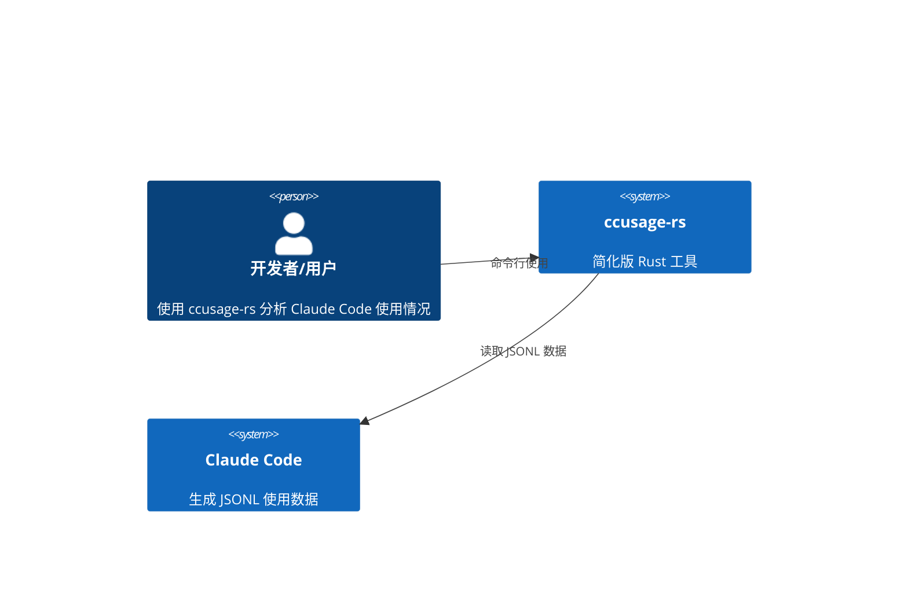

# ccusage-rs 系统架构设计 (简化版)

## 执行摘要

ccusage-rs 是一个用 Rust 重写的 Claude Code 使用情况分析工具，**简化架构设计**，专注于提供与原始 TypeScript 版本相同的核心功能，同时确保高可测试性和易维护性。该系统将分析 Claude Code 在本地存储的 JSONL 格式使用数据，提供基本的 token 使用统计、成本计算和报告生成功能。

## 设计原则

1. **简单优先**：减少不必要的抽象层和复杂性
2. **可测试性**：所有组件都设计为可单元测试
3. **错误处理**：统一、简单的错误处理架构
4. **性能优化**：针对大数据集进行优化
5. **兼容性**：与原版 ccusage 的数据格式和命令行接口兼容

## 简化架构概述

### 系统上下文


### 简化模块结构
```
src/
├── main.rs                 # 应用程序入口点
├── cli.rs                  # 命令行接口 (简化版)
├── data/                   # 数据处理 (简化版)
│   ├── mod.rs
│   ├── models.rs           # 核心数据模型
│   ├── parser.rs           # JSONL 解析器
│   └── loader.rs           # 数据加载器
├── analysis/               # 分析引擎 (简化版)
│   ├── mod.rs
│   ├── calculator.rs       # 成本计算器
│   └── aggregator.rs       # 数据聚合器
├── output/                 # 输出系统 (简化版)
│   ├── mod.rs
│   ├── table.rs            # 表格输出
│   └── json.rs             # JSON 输出
├── config/                 # 配置系统 (简化版)
│   ├── mod.rs
│   └── settings.rs         # 配置管理
├── error.rs                # 统一错误处理
└── utils.rs                # 工具函数
```

## 核心数据模型 (简化版)

### 与原版兼容的数据结构
```rust
// 使用数据条目 (与原版兼容)
#[derive(Debug, Clone, Serialize, Deserialize)]
pub struct UsageEntry {
    pub timestamp: DateTime<Utc>,
    pub model: String,
    pub usage: TokenUsage,
    pub cost_usd: Option<f64>,
    pub session_id: Option<String>,
    pub project_path: Option<String>,
    pub request_id: String,
    pub message_id: String,
}

// Token 使用统计 (与原版兼容)
#[derive(Debug, Clone, Serialize, Deserialize)]
pub struct TokenUsage {
    pub input_tokens: u64,
    pub output_tokens: u64,
    pub cache_creation_input_tokens: Option<u64>,
    pub cache_read_input_tokens: Option<u64>,
}

// 日报数据 (简化版)
#[derive(Debug, Clone, Serialize, Deserialize)]
pub struct DailyUsage {
    pub date: NaiveDate,
    pub input_tokens: u64,
    pub output_tokens: u64,
    pub cache_creation_tokens: u64,
    pub cache_read_tokens: u64,
    pub total_tokens: u64,
    pub total_cost: f64,
    pub models_used: Vec<String>,
}

// 配置结构 (简化版)
#[derive(Debug, Clone, Serialize, Deserialize)]
pub struct Config {
    pub data_dir: Option<PathBuf>,
    pub cost_mode: CostMode,
    pub timezone: String,
    pub locale: String,
    pub offline: bool,
    pub compact: bool,
    pub debug: bool,
}

#[derive(Debug, Clone, Serialize, Deserialize)]
pub enum CostMode {
    Auto,
    Calculate,
    Display,
}
```

## 简化技术栈

### 核心依赖 (最小化)
```toml
[dependencies]
# 核心依赖
tokio = { version = "1.42", features = ["full"] }
serde = { version = "1.0", features = ["derive"] }
serde_json = "1.0"
clap = { version = "4.5", features = ["derive"] }
chrono = { version = "0.4", features = ["serde"] }
anyhow = "1.0"
thiserror = "1.0"

# 文件处理
dirs = "5.0"
walkdir = "2.5"

# 输出格式化
comfy-table = "7.1"
csv = "1.3"

# 可选功能 (feature gates)
reqwest = { version = "0.12", features = ["json"], optional = true }
notify = { version = "7.0", optional = true }
```

### 功能特性开关
```toml
[features]
default = ["core"]
core = []
network = ["reqwest"]
monitoring = ["notify"]
full = ["core", "network", "monitoring"]
```

## 核心组件设计 (简化版)

### 数据处理器 (简化版)
```rust
pub struct DataProcessor {
    config: Config,
}

impl DataProcessor {
    pub fn new(config: Config) -> Self {
        Self { config }
    }
    
    pub async fn load_entries(&self, path: &Path) -> Result<Vec<UsageEntry>> {
        // 简化的数据加载逻辑
        let content = tokio::fs::read_to_string(path).await?;
        let entries: Vec<UsageEntry> = content
            .lines()
            .filter_map(|line| serde_json::from_str(line).ok())
            .collect();
        Ok(entries)
    }
    
    pub fn filter_by_date(&self, entries: &[UsageEntry], start: DateTime<Utc>, end: DateTime<Utc>) -> Vec<UsageEntry> {
        entries
            .iter()
            .filter(|entry| entry.timestamp >= start && entry.timestamp <= end)
            .cloned()
            .collect()
    }
}
```

### 成本计算器 (简化版)
```rust
pub struct CostCalculator {
    pricing_cache: HashMap<String, f64>,
}

impl CostCalculator {
    pub fn new() -> Self {
        Self {
            pricing_cache: HashMap::new(),
        }
    }
    
    pub fn calculate_entry_cost(&self, entry: &UsageEntry, mode: &CostMode) -> Result<f64> {
        match mode {
            CostMode::Display => {
                entry.cost_usd.ok_or_else(|| anyhow!("No pre-calculated cost available"))
            }
            CostMode::Calculate => {
                // 简化的成本计算逻辑
                let input_price = self.get_model_price(&entry.model, "input")?;
                let output_price = self.get_model_price(&entry.model, "output")?;
                
                let input_cost = entry.usage.input_tokens as f64 * input_price;
                let output_cost = entry.usage.output_tokens as f64 * output_price;
                
                Ok(input_cost + output_cost)
            }
            CostMode::Auto => {
                if let Some(cost) = entry.cost_usd {
                    Ok(cost)
                } else {
                    self.calculate_entry_cost(entry, &CostMode::Calculate)
                }
            }
        }
    }
    
    fn get_model_price(&self, model: &str, token_type: &str) -> Result<f64> {
        // 简化的定价逻辑 - 使用硬编码的默认价格
        match model {
            "claude-3-sonnet-20240229" => match token_type {
                "input" => Ok(0.000003),
                "output" => Ok(0.000015),
                _ => Err(anyhow!("Invalid token type")),
            },
            "claude-3-opus-20240229" => match token_type {
                "input" => Ok(0.000015),
                "output" => Ok(0.000075),
                _ => Err(anyhow!("Invalid token type")),
            },
            _ => Err(anyhow!("Unknown model: {}", model)),
        }
    }
}
```

### 数据聚合器 (简化版)
```rust
pub struct DataAggregator;

impl DataAggregator {
    pub fn aggregate_daily(&self, entries: &[UsageEntry]) -> Vec<DailyUsage> {
        let mut daily_map = HashMap::new();
        
        for entry in entries {
            let date = entry.timestamp.date_naive();
            let daily = daily_map.entry(date).or_insert(DailyUsage {
                date,
                input_tokens: 0,
                output_tokens: 0,
                cache_creation_tokens: 0,
                cache_read_tokens: 0,
                total_tokens: 0,
                total_cost: 0.0,
                models_used: Vec::new(),
            });
            
            daily.input_tokens += entry.usage.input_tokens;
            daily.output_tokens += entry.usage.output_tokens;
            daily.cache_creation_tokens += entry.usage.cache_creation_input_tokens.unwrap_or(0);
            daily.cache_read_tokens += entry.usage.cache_read_input_tokens.unwrap_or(0);
            daily.total_cost += entry.cost_usd.unwrap_or(0.0);
            
            if !daily.models_used.contains(&entry.model) {
                daily.models_used.push(entry.model.clone());
            }
        }
        
        let mut daily_data: Vec<DailyUsage> = daily_map.into_values().collect();
        daily_data.sort_by(|a, b| a.date.cmp(&b.date));
        
        // 计算总token数
        for daily in &mut daily_data {
            daily.total_tokens = daily.input_tokens + daily.output_tokens + 
                                 daily.cache_creation_tokens + daily.cache_read_tokens;
        }
        
        daily_data
    }
}
```

## 简化的CLI设计

### 核心命令 (仅实现必要功能)
```rust
#[derive(Subcommand)]
pub enum Commands {
    /// 生成日报
    Daily {
        #[arg(long)]
        date: Option<String>,
        #[arg(long)]
        project: Option<String>,
        #[arg(long)]
        breakdown: bool,
    },
    /// 生成月报
    Monthly {
        #[arg(long)]
        year: Option<u32>,
        #[arg(long)]
        month: Option<u32>,
    },
    /// 会话分析
    Session {
        #[arg(long)]
        session_id: Option<String>,
        #[arg(long)]
        list: bool,
    },
    /// 计费块分析
    Blocks {
        #[arg(long)]
        active: bool,
        #[arg(long)]
        token_limit: Option<u64>,
    },
}
```

## 统一错误处理

### 简化错误类型
```rust
#[derive(Error, Debug)]
pub enum CcusageError {
    #[error("Configuration error: {0}")]
    Config(String),
    
    #[error("Data loading error: {0}")]
    DataLoading(String),
    
    #[error("File system error: {0}")]
    FileSystem(String),
    
    #[error("Parse error: {0}")]
    Parse(#[from] serde_json::Error),
    
    #[error("IO error: {0}")]
    Io(#[from] std::io::Error),
    
    #[error("Network error: {0}")]
    Network(String),
    
    #[error("Validation error: {0}")]
    Validation(String),
}

pub type Result<T> = std::result::Result<T, CcusageError>;
```

## 可测试性设计

### 依赖注入模式
```rust
pub struct App {
    config: Config,
    data_processor: Arc<DataProcessor>,
    cost_calculator: Arc<CostCalculator>,
    aggregator: Arc<DataAggregator>,
}

impl App {
    pub fn new(config: Config) -> Self {
        Self {
            data_processor: Arc::new(DataProcessor::new(config.clone())),
            cost_calculator: Arc::new(CostCalculator::new()),
            aggregator: Arc::new(DataAggregator),
            config,
        }
    }
    
    // 用于测试的构造函数
    pub fn with_components(
        config: Config,
        data_processor: Arc<DataProcessor>,
        cost_calculator: Arc<CostCalculator>,
        aggregator: Arc<DataAggregator>,
    ) -> Self {
        Self {
            config,
            data_processor,
            cost_calculator,
            aggregator,
        }
    }
}
```

### 测试友好的接口
```rust
#[cfg(test)]
mod tests {
    use super::*;
    
    fn create_test_config() -> Config {
        Config {
            data_dir: Some(PathBuf::from("/tmp")),
            cost_mode: CostMode::Calculate,
            timezone: "UTC".to_string(),
            locale: "en".to_string(),
            offline: true,
            compact: false,
            debug: false,
        }
    }
    
    fn create_test_entries() -> Vec<UsageEntry> {
        vec![
            UsageEntry {
                timestamp: Utc::now(),
                model: "claude-3-sonnet-20240229".to_string(),
                usage: TokenUsage {
                    input_tokens: 1000,
                    output_tokens: 500,
                    cache_creation_input_tokens: Some(200),
                    cache_read_input_tokens: Some(100),
                },
                cost_usd: Some(0.015),
                session_id: Some("test-session".to_string()),
                project_path: Some("/test/project".to_string()),
                request_id: "req-1".to_string(),
                message_id: "msg-1".to_string(),
            },
        ]
    }
    
    #[test]
    fn test_daily_aggregation() {
        let aggregator = DataAggregator;
        let entries = create_test_entries();
        let daily_data = aggregator.aggregate_daily(&entries);
        
        assert_eq!(daily_data.len(), 1);
        assert_eq!(daily_data[0].input_tokens, 1000);
        assert_eq!(daily_data[0].output_tokens, 500);
    }
    
    #[tokio::test]
    async fn test_data_loading() {
        let config = create_test_config();
        let processor = DataProcessor::new(config);
        
        // 创建测试数据文件
        let test_data = create_test_entries();
        let test_file = "/tmp/test_usage.jsonl";
        
        // 写入测试数据
        let mut content = String::new();
        for entry in &test_data {
            content.push_str(&serde_json::to_string(entry).unwrap());
            content.push('\n');
        }
        tokio::fs::write(test_file, content).await.unwrap();
        
        // 测试加载
        let loaded = processor.load_entries(Path::new(test_file)).await.unwrap();
        assert_eq!(loaded.len(), test_data.len());
    }
}
```

## 性能优化策略

### 内存优化
- **流式处理**: 使用迭代器处理大数据集，避免全量加载
- **零拷贝**: 尽可能使用引用而不是克隆数据
- **内存池**: 重用对象减少内存分配

### 处理优化
- **并行处理**: 使用 Rayon 进行数据并行处理
- **增量处理**: 支持增量数据加载和处理
- **缓存策略**: 智能缓存计算结果

## 部署和分发

### 简化构建配置
```toml
[profile.release]
lto = true
codegen-units = 1
panic = "abort"
strip = true
opt-level = 3
```

### 跨平台支持
- Linux (x86_64, ARM64)
- macOS (x86_64, ARM64)  
- Windows (x86_64)
- 静态链接选项

## 总结

这个简化版的架构设计具有以下优势：

1. **简单性**: 减少了不必要的复杂性，更容易理解和维护
2. **可测试性**: 所有组件都可以独立测试
3. **性能**: 针对大数据集进行了优化
4. **兼容性**: 与原版 ccusage 的数据格式和命令行接口兼容
5. **可扩展性**: 通过 feature gates 支持可选功能

该架构为项目提供了一个坚实的基础，可以逐步实现功能并确保质量。